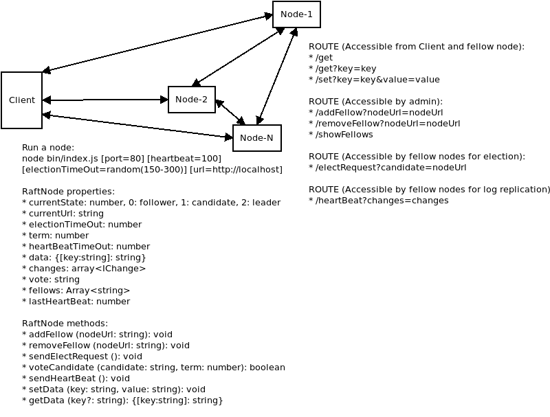

# Raft Consensus Algorithm

Raft is a consensus algorithm that is designed to be easy to understand. It's equivalent to Paxos in fault-tolerance and performance. The difference is that it's decomposed into relatively independent subproblems, and it cleanly addresses all major pieces needed for practical systems. We hope Raft will make consensus available to a wider audience, and that this wider audience will be able to develop a variety of higher quality consensus-based systems than are available today. [ref](https://raft.github.io/)

You can find a visual brief of the algorithm [here](http://thesecretlivesofdata.com/raft/)

In Raft, every node can be either:
* A follower
* A candidate
* A leader

There are two phases in Raft. The first one is leader selection, and the second one is log replication.

Every node started as follower. If these followers doesn't hear any `heartbeat request` for a certain amount of time (`election timeout`), it will turn into candidate. A candidate will broadcast `election request`. Once it get votes from majority, the candidate turn into `leader`.

Leader is responsible for replicating values. In order to fulfill the job, a leader regularly sends `heartbeat request`.

If a client ask the Leader to change the value, the Leader will propagate the changes to all the followers. This propagation is sent along with the next `heartbeat request`. After getting the respond from the followers, the leader should commit the changes and re-propagate commit message to the followers (using the same `heartbeat request`)

# Implementation

I try to implement the algorithm using `typescript` and `express`. I also use `jest` for unit-testing.

In my implementation every Node (leader, candidate, and follower) can handle the request from the client. This client request is then propagated to the leader. Everything else works as the original Raft specification.

# Test Case

In the test-case, I made 3 nodes that run on port `3010`, `3011`, and `3012`.



The test is divided into several sub-process.

## Starting The Server

To start the server, you can execute `node dist/index.js <port> <heartBeatTimeOut> <electionTimeOut> <baseUrl>`

This is how to run a node at port 3010:

```bash
node dist/index.js 3010 50 150 "http://localhost:3010"
```

The node can also be started programmatically. For example, the my unit-test (`src/classes/RaftNode.test.ts`), I do this:

```typescript
const node1 = new RaftNode(port1, heartBeatTimeOut1, electionTimeOut1, baseUrl);
let server1: http.Server;

it("run node1", (done) => {
  server1 = node1.run(() => {
    expect(server1.listening).toBeTruthy();
    done();
  });
});
```

At the end of the test, I can even turn off the server by executing `server1.close()`.

In the unit-test, I run node1, node2, and node3.

## Add, remove, and show fellows

One of the most critical requirement in Raft (and I think many distribution algorithm) is how a node can recognize each others.

This is how I add, remove, and show fellow:

```typescript
it("add node2 to node1", (done) => {
  httpRequest(`${url1}/addFellow?nodeUrl=${url2}`, (error, response, body) => {
    const result: boolean = JSON.parse(body);
    expect(result).toBeTruthy();
    done();
  });
});

it("confirm that node1 has two fellows", (done) => {
  httpRequest(`${url1}/showFellows`, (error, response, body) => {
    const result: any[] = JSON.parse(body);
    expect(result[0]).toBe(url2);
    expect(result[1]).toBe(url3);
    expect(result.length).toBe(2);
    done();
  });
});

it("remove node1 from node3", (done) => {
  httpRequest(`${url3}/removeFellow?nodeUrl=${url1}`, (error, response, body) => {
    const result: boolean = JSON.parse(body);
    expect(result).toBeTruthy();
    done();
  });
});
```

You can also send `HTTP GET` request to the node

## Leader Selection

Leader selection run automatically once the node acknowledge each other. What we have to do is just `wait`

```typescript
it("wait for a while", (done) => {
  setTimeout(() => {
    node1.logState();
    node2.logState();
    node3.logState();
    done();
  }, 500);
});
```

Deep down inside `RaftNode class` (`/src/classes/RaftNode.ts`), there is a `loop` method to handle the state-changes.

The state is represented in `currentState` property. Follower should have `currentState === 0`, while Candidate and Leader will have `1` and `2` respectively.

```
public loop(): void {
  if (this.currentState === 0) {
    if (this.isNotAcceptHeartBeat()) {
      // make this a candidate and run again
      this.currentState = 1;
      this.currentLeader = "";
      this.vote = "";
      this.loop();
    } else {
      // run again after electionTimeOut
      setTimeout(() => this.loop(), this.electionTimeOut);
    }
  } else if (this.currentState === 1) {
    // send elect request and wait
    this.sendElectRequest();
  } else if (this.currentState === 2) {
    if (this.isNotAcceptHeartBeat()) {
      this.currentState = 0;
      this.currentLeader = "";
      this.vote = "";
      this.loop();
    } else {
      this.sendHeartBeat();
    }
  }
}
```

## Set and Get Values

In the test-case, I send the new value `foo = bar` to node1, wait for a while, and fetch the value from node2 and node3. (__Note__: After leader selection, the leader is now node2)

```typescript
it("send setData to node 1", (done) => {
  httpRequest(`${url1}/set?key=foo&value=bar`, (error, response, body) => {
    const result: boolean = JSON.parse(body);
    expect(result).toBeTruthy();
    done();
  });
});

it("wait for a while", (done) => {
  setTimeout(() => {
    node1.logState();
    node2.logState();
    node3.logState();
    done();
  }, 500);
});

it("retrieve data from node2", (done) => {
  httpRequest(`${url2}/get?key=foo`, (error, response, body) => {
    const result: any = JSON.parse(body);
    expect(result.foo).toBe("bar");
    done();
  });
});

it("retrieve data from node3", (done) => {
  httpRequest(`${url3}/get?key=foo`, (error, response, body) => {
    const result: any = JSON.parse(body);
    expect(result.foo).toBe("bar");
    done();
  });
});
```

## Close The Nodes

To close the nodes, I simply invoke

```typescript
it("close node1", (done) => {
  server1.close(() => {
    expect(server1.listening).toBeFalsy();
    done();
  });
});

it("close node2", (done) => {
  server2.close(() => {
    expect(server2.listening).toBeFalsy();
    done();
  });
});

it("close node3", (done) => {
  server3.close(() => {
    expect(server3.listening).toBeFalsy();
    done();
  });
});
```

# Result

The test runs well. The log is replicated perfectly. :)

```

> kalimat.ai@1.0.0 pretest /home/gofrendi/Projects/kalimat.ai
> npm run lint && tsc --sourcemap


> kalimat.ai@1.0.0 lint /home/gofrendi/Projects/kalimat.ai
> tslint -c tslint.json 'src/**/*.{ts,tsx}'


> kalimat.ai@1.0.0 test /home/gofrendi/Projects/kalimat.ai
> jest

PASS src/classes/RaftNode.test.ts
  ● Console

    console.log src/classes/RaftNode.ts:297
      Initiating RaftNode at http://localhost:3010
    console.log src/classes/RaftNode.ts:297
      Initiating RaftNode at http://localhost:3011
    console.log src/classes/RaftNode.ts:297
      Initiating RaftNode at http://localhost:3012
    console.log src/classes/RaftNode.ts:189
      { changes: [],
        currentLeader: 'http://localhost:3011',
        currentUrl: 'http://localhost:3010',
        data: {},
        fellows: [ 'http://localhost:3011', 'http://localhost:3012' ],
        state: 'Follower',
        term: 2,
        vote: 'http://localhost:3011' }
    console.log src/classes/RaftNode.ts:189
      { changes: [],
        currentLeader: 'http://localhost:3011',
        currentUrl: 'http://localhost:3011',
        data: {},
        fellows: [ 'http://localhost:3010', 'http://localhost:3012' ],
        state: 'Leader',
        term: 2,
        vote: 'http://localhost:3011' }
    console.log src/classes/RaftNode.ts:189
      { changes: [],
        currentLeader: 'http://localhost:3011',
        currentUrl: 'http://localhost:3012',
        data: {},
        fellows: [ 'http://localhost:3011', 'http://localhost:3010' ],
        state: 'Follower',
        term: 2,
        vote: 'http://localhost:3011' }
    console.log src/classes/RaftNode.ts:189
      { changes: 
         [ { key: 'foo', value: 'bar', state: 1 },
           { key: 'spam', value: 'egg', state: 1 } ],
        currentLeader: 'http://localhost:3011',
        currentUrl: 'http://localhost:3010',
        data: { foo: 'bar', spam: 'egg' },
        fellows: [ 'http://localhost:3011', 'http://localhost:3012' ],
        state: 'Follower',
        term: 2,
        vote: 'http://localhost:3011' }
    console.log src/classes/RaftNode.ts:189
      { changes: 
         [ { key: 'foo', value: 'bar', state: 1 },
           { key: 'spam', value: 'egg', state: 1 } ],
        currentLeader: 'http://localhost:3011',
        currentUrl: 'http://localhost:3011',
        data: { foo: 'bar', spam: 'egg' },
        fellows: [ 'http://localhost:3010', 'http://localhost:3012' ],
        state: 'Leader',
        term: 2,
        vote: 'http://localhost:3011' }
    console.log src/classes/RaftNode.ts:189
      { changes: 
         [ { key: 'foo', value: 'bar', state: 1 },
           { key: 'spam', value: 'egg', state: 1 } ],
        currentLeader: 'http://localhost:3011',
        currentUrl: 'http://localhost:3012',
        data: { foo: 'bar', spam: 'egg' },
        fellows: [ 'http://localhost:3011', 'http://localhost:3010' ],
        state: 'Follower',
        term: 2,
        vote: 'http://localhost:3011' }

PASS dist/classes/RaftNode.test.js
  ● Console

    console.log dist/classes/RaftNode.js:282
      Initiating RaftNode at http://localhost:3010
    console.log dist/classes/RaftNode.js:282
      Initiating RaftNode at http://localhost:3011
    console.log dist/classes/RaftNode.js:282
      Initiating RaftNode at http://localhost:3012
    console.log dist/classes/RaftNode.js:182
      { changes: [],
        currentLeader: 'http://localhost:3011',
        currentUrl: 'http://localhost:3010',
        data: {},
        fellows: [ 'http://localhost:3011', 'http://localhost:3012' ],
        state: 'Follower',
        term: 1,
        vote: 'http://localhost:3011' }
    console.log dist/classes/RaftNode.js:182
      { changes: [],
        currentLeader: 'http://localhost:3011',
        currentUrl: 'http://localhost:3011',
        data: {},
        fellows: [ 'http://localhost:3010', 'http://localhost:3012' ],
        state: 'Leader',
        term: 1,
        vote: 'http://localhost:3011' }
    console.log dist/classes/RaftNode.js:182
      { changes: [],
        currentLeader: 'http://localhost:3011',
        currentUrl: 'http://localhost:3012',
        data: {},
        fellows: [ 'http://localhost:3011', 'http://localhost:3010' ],
        state: 'Follower',
        term: 1,
        vote: 'http://localhost:3011' }
    console.log dist/classes/RaftNode.js:182
      { changes: 
         [ { key: 'foo', value: 'bar', state: 1 },
           { key: 'spam', value: 'egg', state: 1 } ],
        currentLeader: 'http://localhost:3011',
        currentUrl: 'http://localhost:3010',
        data: { foo: 'bar', spam: 'egg' },
        fellows: [ 'http://localhost:3011', 'http://localhost:3012' ],
        state: 'Follower',
        term: 1,
        vote: 'http://localhost:3011' }
    console.log dist/classes/RaftNode.js:182
      { changes: 
         [ { key: 'foo', value: 'bar', state: 1 },
           { key: 'spam', value: 'egg', state: 1 } ],
        currentLeader: 'http://localhost:3011',
        currentUrl: 'http://localhost:3011',
        data: { foo: 'bar', spam: 'egg' },
        fellows: [ 'http://localhost:3010', 'http://localhost:3012' ],
        state: 'Leader',
        term: 1,
        vote: 'http://localhost:3011' }
    console.log dist/classes/RaftNode.js:182
      { changes: 
         [ { key: 'foo', value: 'bar', state: 1 },
           { key: 'spam', value: 'egg', state: 1 } ],
        currentLeader: 'http://localhost:3011',
        currentUrl: 'http://localhost:3012',
        data: { foo: 'bar', spam: 'egg' },
        fellows: [ 'http://localhost:3011', 'http://localhost:3010' ],
        state: 'Follower',
        term: 1,
        vote: 'http://localhost:3011' }


Test Suites: 2 passed, 2 total
Tests:       56 passed, 56 total
Snapshots:   0 total
Time:        4.246s
Ran all test suites.
```

# Deployment

I deploy the solution by using `heroku` platform. The nodes are exposed as `kalimat-1.herokuapp.com`, `kalimat-2.herokuapp.com`, and `kalimat-3.herokuapp.com`.

In order to make this single git repository deployable to those 3 nodes, I add `Profile` and modify `.git/config`.

The content of `Procfile` is as follow:

```
web: node dist/index.js $PORT 50 150 $HEROKU_APP_NAME.herokuapp.com kalimat1.herokuapp.com kalimat2.herokuapp.com kalimat3.herokuapp.com
```

while the content of `.git/config` is as presented below:

```
[core]
	repositoryformatversion = 0
	filemode = true
	bare = false
	logallrefupdates = true
[remote "origin"]
	url = git@github.com:goFrendiAsgard/raft.git
	fetch = +refs/heads/*:refs/remotes/origin/*
[branch "master"]
	remote = origin
	merge = refs/heads/master
[remote "kalimat1"]
	url = https://git.heroku.com/kalimat-1.git
	fetch = +refs/heads/*:refs/remotes/heroku/*
[remote "kalimat2"]
	url = https://git.heroku.com/kalimat-2.git
	fetch = +refs/heads/*:refs/remotes/heroku/*
[remote "kalimat3"]
	url = https://git.heroku.com/kalimat-3.git
	fetch = +refs/heads/*:refs/remotes/heroku/*
```

Aside from modifying the files, I also has to enable labs feature using this command

```bash
heroku labs:enable runtime-dyno-metadata -a kalimat-1
heroku labs:enable runtime-dyno-metadata -a kalimat-2
heroku labs:enable runtime-dyno-metadata -a kalimat-3
```

# Conclusion

This is my first experience doing a project with `typescript` and `jest`. I like how things work so far.

I believe that my code is not so idiomatic. I put everything in `RaftNode` class, and I'm not sure I will be able to easily fix things one month from now.

However, things are working as expected.
